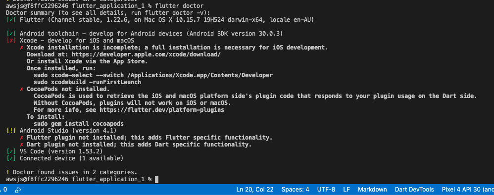

# Prerequisites

You will need the following in order to execute this Workshop

1. An AWS Account with sufficient permission to create AWS IAM, Amazon DynamoDB, Amazon Cognito and AWS Amplify resources.

2. An [editor](https://code.visualstudio.com/) that is compatible with Flutter. This Workshop provides prescriptive guidance for Visual Studio Code. For optimal developer experience it is recommended to install `Dart` and `Flutter` [extensions in Visual Studio Code](https://code.visualstudio.com/docs/editor/extension-gallery).

3. [Install](https://docs.amplify.aws/cli/start/install) Amplify CLI - This is the tool we will use to create and modify the AWS Amplify resources.

4. Configure Amplify CLI. 
For further details you can [watch the video guide](https://docs.amplify.aws/cli/start/install#option-1-watch-the-video-guide) 
or follow [these instructions](https://docs.amplify.aws/cli/start/install#option-2-follow-the-instructions)

5. Install [Flutter](https://flutter.dev/docs/get-started/install) version 2.0.1 or higher. Only install Flutter and add it to your path ( [Windows](https://flutter.dev/docs/get-started/install/windows#update-your-path) || [macOS](https://flutter.dev/docs/get-started/install/macos#update-your-path)) at this point, further configuration occurs in the following step.

6. Some basic experience with Android / iOS app development (i.e. familiarity with Android Studio interface such as launching Android Emulator).

7. A device [emulator](https://developer.android.com/studio) to run the Flutter application on. Download and install Android Studio and create a device emulator using the instructions for your platform - [macOS](https://flutter.dev/docs/get-started/install/macos#set-up-the-android-emulator) || [Windows](https://flutter.dev/docs/get-started/install/windows#set-up-the-android-emulator)
This Workshop provides prescriptive guidance on working emulating Android as Android Studio supports Windows and macOS development environments.

8. Finally, check configuration using :
``` bash
flutter doctor
```
Your output should look similar to the below :


**Congratulations, you're now ready to commence the Workshop!**


[<- Back](../README.md) || [Module 1 ->](../module1/README.md) 