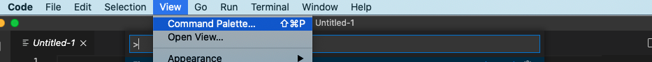
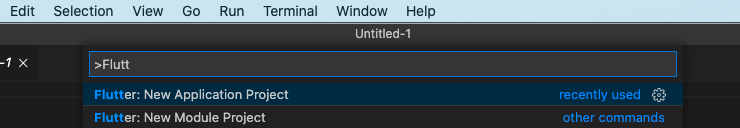
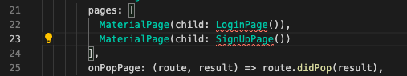

# Module 1

## Introduction
AWS Amplify is a suite of tools that allow developers to build apps quicker by providing easy to use libraries that make it possible to authenticate users, store files, capture analytics events, and much more, with just a few lines of code.

In this module, you'll create and build out the UI of an app. This includes the sign-up flow, and page for XXX.

This module will set the foundation of our app so the following modules can focus on the actual Amplify implementations for the specific category.

## What You Will Learn
* Implement a sign-up and login flow
* Navigation between screens
* Implement a grid of widgets

## Key Concepts
Navigator - This tutorial will be using the Flutter Navigator 2.0, which uses a list of pages to determine which view should be displayed using a declarative implementation.

Callbacks - In order to send data from one object to another, we will be using callbacks for communication. A callback is similar to a function in that it can be passed an argument from the call site, but it executes code elsewhere.

## Implementation

### Create a Flutter project




Start Visual Studio Code, we'll use Command Palette to create a new Flutter Application

Create a new Flutter Application with a name of your choice. In this workshop we'll use the name **workshop_app**



Once your project is setup, replace the boilerplate code in **main.dart** with the following:
``` javascript
import 'package:flutter/material.dart';

void main() {
  runApp(MyApp());
}

// 1
class MyApp extends StatefulWidget {
  @override
  State<StatefulWidget> createState() => _MyAppState();
}

class _MyAppState extends State<MyApp> {
  @override
  Widget build(BuildContext context) {
    return MaterialApp(
      title: 'Workshop App',
      theme: ThemeData(visualDensity: VisualDensity.adaptivePlatformDensity),
      // 2
      home: Navigator(
        pages: [],
        onPopPage: (route, result) => route.didPop(result),
      ),
    );
  }
}
```
1. We have changed out MyApp widget into a StatefulWidget. We will be manipulating its state later.
2. The home widget of our MaterialApp is a Navigator which will allow setup our navigation in a declarative way.

### Create the Authentication Flow
Before we can add pages to our Navigator, we need to create the widgets that will represent each of our pages. Let's start with the login page which we will put in a new file called **login_page.dart** in the /lib/ directory, this is the same directory as main.dart.

``` javascript
import 'package:flutter/material.dart';

class LoginPage extends StatefulWidget {
  @override
  State<StatefulWidget> createState() => _LoginPageState();
}

class _LoginPageState extends State<LoginPage> {
  // 1
  final _usernameController = TextEditingController();
  final _passwordController = TextEditingController();

  @override
  Widget build(BuildContext context) {
    // 2
    return Scaffold(
      // 3
      body: SafeArea(
          minimum: EdgeInsets.symmetric(horizontal: 40),
          // 4
          child: Stack(children: [
            // Login Form
            _loginForm(),

            // 6
            // Sign Up Button
            Container(
              alignment: Alignment.bottomCenter,
              child: FlatButton(
                  onPressed: () {},
                  child: Text('Don\'t have an account? Sign up.')),
            )
          ])),
    );
  }

  // 5
  Widget _loginForm() {
    return Column(
      mainAxisAlignment: MainAxisAlignment.center,
      children: [
        // Username TextField
        TextField(
          controller: _usernameController,
          decoration:
              InputDecoration(icon: Icon(Icons.mail), labelText: 'Username'),
        ),

        // Password TextField
        TextField(
          controller: _passwordController,
          decoration: InputDecoration(
              icon: Icon(Icons.lock_open), labelText: 'Password'),
          obscureText: true,
          keyboardType: TextInputType.visiblePassword,
        ),

        // Login Button
        FlatButton(
            onPressed: _login,
            child: Text('Login'),
            color: Theme.of(context).accentColor)
      ],
    );
  }

  // 7
  void _login() {
    final username = _usernameController.text.trim();
    final password = _passwordController.text.trim();

    print('username: $username');
    print('password: $password');
  }
}
```

1. Since LoginPage requires user input, we need to keep track of that state by having a TextEditingController for each field on the screen; in this case: username and password.
2. _LoginPageState.build will return a Scaffold that will allow our widgets to be formatted properly for a mobile device.
3. It's important to observe the SafeArea since the app will be capable of running on multiple devices. In this case, we're also taking advantage of the minimum edge insets to add padding on both the left and right sides of the screen so the login form wont be from edge to edge.
4. Our UI will consist of the primary login form and a button at the bottom of the screen that will allow the user to sign up instead of login. We're using a stack here to make it easier to manipulate the placement of each child widget.
5. Creating a _loginForm function is completely optional, but it does declutter the build method a bit. Here we are implementing the UI for the username and password textfields, as well as the login button.
6. Out sign up button will take the form of an interactive sentence that allows the user to sign up if they don't already have an account. No onPressed functionality is implemented yet.
7. The _login method will be responsible for extracting the values from the textfield controllers and creating an AuthCredentials object. Right now it is simply printing the values of each controller.

The UI of LoginPage is not finished, let's add it to the Navigator in **main.dart**.
``` javascript
... // home: Navigator( (line 20)

pages: [MaterialPage(child: LoginPage())],

... // onPopPage: (route, result) => route.didPop(result),
``` 

The pages parameter takes a List<Page<dynamic>>, so we pass in a single MaterialPage where our LoginPage is the child.

Give the app a run (F5 in Visual Studio Code) and you should see your LoginPage.


The user will need to be able to sign up befor they can sign in. Let's implement the SignUpPage in a new file **sign_up_page.dart**
``` javascript
import 'package:flutter/material.dart';

class SignUpPage extends StatefulWidget {
  @override
  State<StatefulWidget> createState() => _SignUpPageState();
}

class _SignUpPageState extends State<SignUpPage> {
  final _usernameController = TextEditingController();
  final _emailController = TextEditingController();
  final _passwordController = TextEditingController();

  @override
  Widget build(BuildContext context) {
    return Scaffold(
      body: SafeArea(
          minimum: EdgeInsets.symmetric(horizontal: 40),
          child: Stack(children: [
            // Sign Up Form
            _signUpForm(),

            // Login Button
            Container(
              alignment: Alignment.bottomCenter,
              child: FlatButton(
                  onPressed: () {},
                  child: Text('Already have an account? Login.')),
            )
          ])),
    );
  }

  Widget _signUpForm() {
    return Column(
      mainAxisAlignment: MainAxisAlignment.center,
      children: [
        // Username TextField
        TextField(
          controller: _usernameController,
          decoration:
              InputDecoration(icon: Icon(Icons.person), labelText: 'Username'),
        ),

        // Email TextField
        TextField(
          controller: _emailController,
          decoration:
              InputDecoration(icon: Icon(Icons.mail), labelText: 'Email'),
        ),

        // Password TextField
        TextField(
          controller: _passwordController,
          decoration: InputDecoration(
              icon: Icon(Icons.lock_open), labelText: 'Password'),
          obscureText: true,
          keyboardType: TextInputType.visiblePassword,
        ),

        // Sign Up Button
        FlatButton(
            onPressed: _signUp,
            child: Text('Sign Up'),
            color: Theme.of(context).accentColor)
      ],
    );
  }

  void _signUp() {
    final username = _usernameController.text.trim();
    final email = _emailController.text.trim();
    final password = _passwordController.text.trim();

    print('username: $username');
    print('email: $email');
    print('password: $password');
  }
}
```
Our SignUpPage is almost identical to the LoginPage with the exception that it has an additional field for email and the text for the buttons have been changed.

Let's add the SignUpPage as a MaterialPage in the Navigator of **main.dart** too.
``` javascript
... // home: Navigator( (line 20)

pages: [
  MaterialPage(child: LoginPage()),
  MaterialPage(child: SignUpPage())
],

... // onPopPage: (route, result) => route.didPop(result),
```

You'll see that there's no definition in scope for LoginPage() and SingupPage(). We'll need to import those classes into scope for main.dart.



Let's add those imports now to **main.dart**
``` javascript
... // import 'package:flutter/material.dart'; (line 1)
import 'login_page.dart';
import 'sign_up_page.dart';
```

We also need to make a configuration update for Android, update minSdkVersion to 21 **./android/app/build.gradle**
``` javascript
... //        applicationId "com.example.workshop_app" (line 41)
        minSdkVersion 21
... //         targetSdkVersion 29
```

For iOS, open the Podfile **./ios/Podfile** and update the platform to 11.0 or higher:
``` javascript
... # Uncomment this line to define a global platform for your project

platform :ios, '11.0'

... # CocoaPods analytics sends network stats synchronously affecting flutter build latency
```

Now run the app, this will usually take a few minutes to launch.


The sign up screen should now be showing when the app launches since it is the last page implemented in the pages list of our Navigator. The Navigator treats the pages argument like a stack, where the last in is on top. This means we are currently seeing the SignUpPage stacked on top of LoginPage.

If we want to display different pages, we will have to implement logic inside of our list to determine when to display specific pages. We can accomplish these updates by creating a Stream and nesting our Navigator in a StreamBuilder.

Create a new file called **auth_service.dart** and add the following:
``` javascript
import 'dart:async';

// 1
enum AuthFlowStatus { login, signUp, verification, session }

// 2
class AuthState {
  final AuthFlowStatus authFlowStatus;

  AuthState({this.authFlowStatus});
}

// 3
class AuthService {
  // 4
  final authStateController = StreamController<AuthState>();

  // 5
  void showSignUp() {
    final state = AuthState(authFlowStatus: AuthFlowStatus.signUp);
    authStateController.add(state);
  }

  // 6
  void showLogin() {
    final state = AuthState(authFlowStatus: AuthFlowStatus.login);
    authStateController.add(state);
  }
}
```
1. AuthFlowStatus is an enumeration that will cover the four different states our auth flow can be in: the login page, sign up page, verification page, or a session. We will be adding the last two pages shortly.
2. AuthState is the actual object we will be observing in our stream and it will contain authFlowStatus as a property.
3. Our AuthService will serve two purposes, manage the stream controller of AuthState as well as contain all of our authentication functionality that will be added in the next module.
4. authStateController is responsible for sending new AuthState's down stream to be observed.
5. This is a simple function to update the AuthState stream to signUp.
6. This does the same as showSignUp but updates the stream to send login.

Open **main.dart** again and add create an instance of AuthService in _MyAppState.

``` javascript
... // class _MyAppState extends State<MyApp> { (line 15)

final _authService = AuthService();

... // @override
```

AuthService needs to be imported to **main.dart**
``` javascript
... // import 'sign_up_page.dart'; (line 3)
import 'auth_service.dart';

```


Now we can wrap the Navigator in a StreamBuilder.

``` javascript
... // theme: ThemeData(visualDensity: VisualDensity.adaptivePlatformDensity), (line 22)

// 1
home: StreamBuilder<AuthState>(
    // 2
    stream: _authService.authStateController.stream,
    builder: (context, snapshot) {
      // 3
      if (snapshot.hasData) {
        return Navigator(
          pages: [
            // 4
            // Show Login Page
            if (snapshot.data.authFlowStatus == AuthFlowStatus.login)
              MaterialPage(child: LoginPage()),

            // 5
            // Show Sign Up Page
            if (snapshot.data.authFlowStatus == AuthFlowStatus.signUp)
              MaterialPage(child: SignUpPage())
          ],
          onPopPage: (route, result) => route.didPop(result),
        );
      } else {
        // 6
        return Container(
          alignment: Alignment.center,
          child: CircularProgressIndicator(),
        );
      }
    }),
    
... // MaterialApp closing ); (line 33)
```
1. We wrapped our Navigator with a StreamBuilder that is expecting to observe a stream emitting AuthState.
2. We access the AuthState stream by accessing it from the authStateController from the instance of AuthService.
3. The stream may or may not have data. In order to safely access authFlowStatus from our data, which is of type AuthState, we implement the check here first.
4. If the stream emits AuthFlowStatus.login we will show LoginPage.
5. If the stream emits AuthFlowStatus.signUp we will show SignUpPage.
6. If the stream doesn't have data, a CircularProgressIndicator is displayed.
To ensure stream has data from the start, a value needs to be emitted immediately. We can accomplish this by sending AuthFlowStatus.login when _MyAppState is initialized.

``` javascript
... // final _authService = AuthService(); (line 17)

@override
void initState() {
 super.initState();
 _authService.showLogin();
}

... // @override
```

If we run the app now, it should be displaying LoginPage as that's the only value that has been emitted through the stream.

We still need to implement the ability to switch between LoginPage and SignUpPage.

Navigate to **login_page.dart** and add the following:
``` javascript
... // class LoginPage extends StatefulWidget { (line 3)

final VoidCallback shouldShowSignUp;

LoginPage({Key key, this.shouldShowSignUp}) : super(key: key);

... // @override (line 4)
```
Our constructor is now accepting a VoidCallback as an arguement which can trigger some functionality in main.dart and called from _LoginPageState.

Pass shouldShowSignUp as the argument for the sign up button in our _LoginPageState:

``` javascript
... // child: FlatButton( (line 32)

onPressed: widget.shouldShowSignUp,

... // child: Text('Don\'t have an account? Sign up.')), (line 34)
```
Back in **main.dart** we need to pass an arguement for the shouldShowSignUp parameter of the LoginPage:
``` javascript
... // if (snapshot.data.authFlowStatus == AuthFlowStatus.login) (line 40)

MaterialPage(
   child: LoginPage(
       shouldShowSignUp: _authService.showSignUp)),

... // Show Sign Up Page
```
Run the app and press the sign up button on LoginPage. It should now navigate to SignUpPage

We need to be able to do the same thing for SignUpPage so the user can switch between sign up and login by tapping the button at the bottom of the screen.

Add the following to **sign_up_page.dart**:

``` javascript
... // class SignUpPage extends StatefulWidget { (line 3)

final VoidCallback shouldShowLogin;

SignUpPage({Key key, this.shouldShowLogin}) : super(key: key);

... // @override
```
``` javascript
... // child: FlatButton( (line 27)

onPressed: widget.shouldShowLogin,

... // child: Text('Already have an account? Login.')),
```

Just as we implemented with LoginPage, SignUpPage will trigger the VoidCallback when the user presses the botton at the bottom of the screen.

Now to simply update **main.dart** to accept an arguement for shouldShowLogin.
``` javascript
... // if (snapshot.data.authFlowStatus == AuthFlowStatus.signUp) (line 46)

MaterialPage(
   child: SignUpPage(
       shouldShowLogin: _authService.showLogin))

... // pages closing ],
```
If you run the app this time, you'll notice you're able to toggle between the LoginPage and SignUpPage.

The last thing needed for each of these pages is a way to pass the user input for each field as credentials that can be processed for login/sign up.

Create a new file called **auth_credentials.dart** and add the following:
``` javascript
// 1
abstract class AuthCredentials {
  final String username;
  final String password;

  AuthCredentials({this.username, this.password});
}

// 2
class LoginCredentials extends AuthCredentials {
  LoginCredentials({String username, String password})
      : super(username: username, password: password);
}

// 3
class SignUpCredentials extends AuthCredentials {
  final String email;

  SignUpCredentials({String username, String password, this.email})
      : super(username: username, password: password);
}
```
1. AuthCredentials is an abstract class that we will use for a baseline of the minimum info needed to perform either login or sign up. This will allow us to use LoginCredentials and SignUpCredentials almost interchangeably.
2. LoginCredentials a simple concrete implementation of AuthCredentials as logging in only requires the username and password.
3. Almost exactly the same as the LoginCredentials but with email being an added field required for signing up.
We can now add login and sign up methods to AuthService which will accept the respective credentials and change the state of the Navigator to the correct page.

Add these two functions to **auth_service.dart**:
``` javascript
... // showLogin closing } (line 28)

// 1
void loginWithCredentials(AuthCredentials credentials) {
 final state = AuthState(authFlowStatus: AuthFlowStatus.session);
 authStateController.add(state);
}

// 2
void signUpWithCredentials(SignUpCredentials credentials) {
 final state = AuthState(authFlowStatus: AuthFlowStatus.verification);
 authStateController.add(state);
}
```

And  auth_credetials to **auth_service.dart**
``` javascript
... // import 'dart:async'; (line 1)
import 'auth_credentials.dart';
... 
```

1. When a user passes any AuthCredentials we will perform some logic and ultimately put the user in a session state.
2. Signing up will require that the email entered is verified by entering a verification code. Thus, the sign up logic should chage the state to verification.

Let's start by updating **login_page.dart** to send LoginCredentials via a ValueChanged property.
 ``` javascript
 ... // import 'package:flutter/material.dart'; (line 1)
 import 'auth_credentials.dart';

 ... // class LoginPage extends StatefulWidget { 

final ValueChanged<LoginCredentials> didProvideCredentials;

... // final VoidCallback shouldShowSignUp;

LoginPage({Key key, this.didProvideCredentials, this.shouldShowSignUp})
   : super(key: key);

... // @override
```
We can now pass our credentials from the _login() method in _LoginPageState:

``` javascript
... // print('password: $password'); (line 80)

final credentials =
  LoginCredentials(username: username, password: password);
widget.didProvideCredentials(credentials);

... // _login closing }
```

Let's implement something similar for **sign_up_page.dart**:

``` javascript
 ... // import 'package:flutter/material.dart'; (line 1)
 import 'auth_credentials.dart';

... // class SignUpPage extends StatefulWidget {

final ValueChanged<SignUpCredentials> didProvideCredentials;

... // final VoidCallback shouldShowLogin;

SignUpPage({Key key, this.didProvideCredentials, this.shouldShowLogin})
   : super(key: key);

... // @override
```
And create the credentials:
``` javascript
... // print('password: $password'); (line 81)

final credentials = SignUpCredentials(
   username: username, 
   email: email, 
   password: password
);
widget.didProvideCredentials(credentials);

... // _signUp closing }
```
Now connect everything in **main.dart**:
``` javascript
... // child: LoginPage( (line 42)

didProvideCredentials: _authService.loginWithCredentials,

... // shouldShowSignUp: _authService.showSignUp)),
```

``` javascript
... // child: SignUpPage( (line 50)

didProvideCredentials: _authService.signUpWithCredentials,

... // shouldShowLogin: _authService.showLogin))
```

That wraps up LoginPage and SignUpPage, but as we saw with AuthFlowStatus we still need to implement a page for verification and pages to represent a session.

Let's add VerificationPage in a new file **verification_page.dart**:
``` javascript
import 'package:flutter/material.dart';

class VerificationPage extends StatefulWidget {
  final ValueChanged<String> didProvideVerificationCode;

  VerificationPage({Key key, this.didProvideVerificationCode})
      : super(key: key);

  @override
  State<StatefulWidget> createState() => _VerificationPageState();
}

class _VerificationPageState extends State<VerificationPage> {
  final _verificationCodeController = TextEditingController();

  @override
  Widget build(BuildContext context) {
    return Scaffold(
      body: SafeArea(
        minimum: EdgeInsets.symmetric(horizontal: 40),
        child: _verificationForm(),
      ),
    );
  }

  Widget _verificationForm() {
    return Column(
      mainAxisAlignment: MainAxisAlignment.center,
      children: [
        // Verification Code TextField
        TextField(
          controller: _verificationCodeController,
          decoration: InputDecoration(
              icon: Icon(Icons.confirmation_number),
              labelText: 'Verification code'),
        ),

        // Verify Button
        FlatButton(
            onPressed: _verify,
            child: Text('Verify'),
            color: Theme.of(context).accentColor)
      ],
    );
  }

  void _verify() {
    final verificationCode = _verificationCodeController.text.trim();
    widget.didProvideVerificationCode(verificationCode);
  }
}
```

The VerificationPage is really just a slimmed down version of LoginPage and only passes a verification code up the widget tree.

Back in **auth_service.dart**, there needs to be a method to handle the verification code and update the state to session.

``` javascript
... // signUpWithCredentials closing } (line 41)

void verifyCode(String verificationCode) {
 final state = AuthState(authFlowStatus: AuthFlowStatus.session);
 authStateController.add(state);
}

... // AuthService closing }
```

Now add the VerificationPage to the Navigator of **main.dart**.
``` javascript
... // import 'auth_service.dart'; (line 4)
import 'verification_page.dart';
```

``` javascript
... // shouldShowLogin: _authService.showLogin)), (line 54)

// Show Verification Code Page
if (snapshot.data.authFlowStatus == AuthFlowStatus.verification)
  MaterialPage(child: VerificationPage(
    didProvideVerificationCode: _authService.verifyCode))

... // pages closing ],
```

Add file **map_page.dart** with the below content. (Placeholder)
``` javascript
import 'package:flutter/material.dart';
import 'map_page.dart';

// 1
class AppFlow extends StatefulWidget {
  // 1
  final VoidCallback shouldLogOut;

  AppFlow({Key key, this.shouldLogOut}) : super(key: key);

  @override
  State<StatefulWidget> createState() => _AppFlowState();
}

class _AppFlowState extends State<AppFlow> {
  // 3
  List<MaterialPage> get _pages {
    return [
      // Show App Page
      MaterialPage(child: MapPage(shouldLogOut: widget.shouldLogOut)),
    ];
  }

  @override
  Widget build(BuildContext context) {
    // 4
    return Navigator(
      pages: _pages,
      onPopPage: (route, result) => route.didPop(result),
    );
  }
}
```


Add **app_flow.dart**
``` javascript
import 'package:flutter/material.dart';

class AppFlow extends StatefulWidget {
  // 1
  final VoidCallback shouldLogOut;

  AppFlow({Key key, this.shouldLogOut}) : super(key: key);

  @override
  State<StatefulWidget> createState() => _AppFlowState();
}

class _AppFlowState extends State<AppFlow> {
  // 3
  List<MaterialPage> get _pages {
    return [
      // Show App Page
      MaterialPage(child: Placeholder()),
    ];
  }

  @override
  Widget build(BuildContext context) {
    // 4
    return Navigator(
      pages: _pages,
      onPopPage: (route, result) => route.didPop(result),
    );
  }
}
```


To close the navigation loop of our UI, we need to add a log out method to **auth_service.dart**.
``` javascript
... // verifyCode closing } (line 46)

void logOut() {
 final state = AuthState(authFlowStatus: AuthFlowStatus.login);
 authStateController.add(state);
}

... // AuthService closing }
```

Finally, implement the case for AppFlow in the Navigator.pages of **main.dart**.
``` javascript
... // import 'verification_page.dart' (line 5)
import 'app_flow.dart';
```

``` javascript
... // _authService.verifyCode)), (line 62)
if (snapshot.data.authFlowStatus == AuthFlowStatus.session)
    MaterialPage(
        child: AppFlow(shouldLogOut: _authService.logOut))
... // pages closing ]                ],
```

### Test the application

The application shout allow you to navigate between sign up, login and the placeholder Map Page.

[<- Prerequisites](../prerequisites/README.md) || [Lab2 ->](../lab2/README.md) 