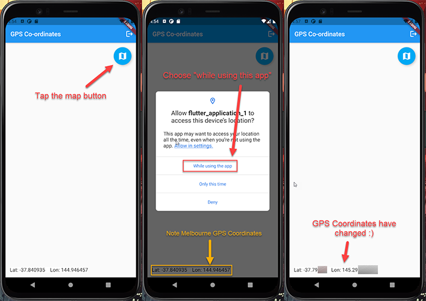

# Module 4

## Introduction
In this module you will learn how to retrieve gps coordinates of a mobile devices location, and show this on google maps.

## What You Will Learn
* Ask for GPS location permissions of end user
* Recieve GPS location of mobile device on Android / iOS

## Key Concepts
GPS Coordinates - GPS coordinates are a unique identifier of a precise geographic location on the earth, usually expressed in alphanumeric characters. Coordinates, in this context, are points of intersection in a grid system. GPS (global positioning system) coordinates are usually expressed as the combination of latitude and longitude.

## Implementation

### Accessing GPS Coordinates

#### Add GPS location dependencies to Flutter
The first step is to add GPS location dependencies as well as configure Android permissions needed for an end user to share a mobile device location.

Add a GPS location library to your ```pubspec.yaml``` file and run ```flutter pub get``` within ```terminal``` (if it doesn't automatically run when saving the file):

``` dart
... // dependencies: (line 23)

geolocator: ^6.2.1

... // pubspec.yaml
```

Add the following permission to your Android Manifest file, located in ```<project root>/android/app/src/main/AndroidManifest.xml```:

``` java
... // <manifest xmlns:android="http://schemas.android.com/apk/res/android"
    package="com.example.workshop_app">
... // (line 3)

<uses-permission android:name="android.permission.ACCESS_FINE_LOCATION" />
<uses-permission android:name="android.permission.ACCESS_COARSE_LOCATION" />
<uses-permission android:name="android.permission.ACCESS_BACKGROUND_LOCATION" />

... // <application android:label=...
```

If you are using an Android Emulator please set up a fake location for this lab:


1.  Open the Android Emulator and navigate to the settings screen


2. Within the location tab, type a location into the search and click save point. This will be where the emulator thinks that it is located when the app asks for a GPS location

#### Add GPS location coordinate discovery to the app
We will now add the code to request GPS location coordinates to the app.

Open the gps_page.dart file located here: ```<project root>/lib/gps_page.dart``` and add the following into your imports:

``` dart
... // import 'package:flutter/material.dart'; (line 1)

import 'package:geolocator/geolocator.dart';

... // gps_page.dart
```

Create a two new classes at the bottom of ```<project root>/lib/gps_page.dart``` - this will allow us to create a view that shows location data dynamically. The most important parts to note are:

1. (line 36) Set a default GPS location before we quiz for the devices realtime GPS location
2. (line 48) Create a button that gets the GPS locations on press and stores them into state management
3. (line 74) Shows the current GPS coordinates down in the bottom left hand side of the screen

``` dart
... // (line 29)

class GpsSubpage extends StatefulWidget {
  @override
  _GpsSubpageState createState() => _GpsSubpageState();
}

class _GpsSubpageState extends State<GpsSubpage> {
  // Set a default GPS location before we quiz for the devices realtime GPS location
  double currentPositionLat = -37.840935;
  double currentPositionLon = 144.946457;

  @override
  void initState() {
    super.initState();
  }

  Widget build(BuildContext context) {
    return Stack(
      children: <Widget>[
        // Create a button that gets the GPS locations on press and stores them into state management
        Padding(
          padding: const EdgeInsets.all(14.0),
          child: Align(
            alignment: Alignment.topRight,
            child: FloatingActionButton(
              onPressed: () async {
                var _positionLon;
                var _positionLat;
                await Geolocator.getCurrentPosition().then((value) => {
                      _positionLon = value.longitude,
                      _positionLat = value.latitude,
                    });
                setState(
                  () {
                    currentPositionLon = _positionLon;
                    currentPositionLat = _positionLat;
                  },
                );
              },
              materialTapTargetSize: MaterialTapTargetSize.padded,
              backgroundColor: Colors.lightBlue,
              child: const Icon(Icons.map, size: 30.0),
            ),
          ),
        ),
        // Shows the current GPS coordinates down in the bottom left hand side of the screen
        Padding(
          padding: const EdgeInsets.all(14.0),
          child: Align(
            alignment: Alignment.bottomLeft,
            child: Text(
              'Lat: $currentPositionLat    Lon: $currentPositionLon',
              style: TextStyle(
                fontSize: 16,
                background: Paint()..color = Colors.white,
              ),
            ),
          ),
        ),
      ],
    );
  }
}

... // gps_page.dart
```

Next, inside the container element of within your main GpsPage class call your newly created GpsSubpage view (make sure to insert this between your containers circle brackets):

``` dart
... // body: Container( (line 22)

child: GpsSubpage(),

... // )

... // gps_page.dart
```

You should now be able to test your application. 

If you tap the top right button that has appeared you should see GPS coordinates printed in the bottom left of the screen. Make sure to allow GPS permissions when using this app when asked!



**Congratulations, you have finished the workshop!**

You can either complete the Optional Lab 5 content, or clean up your AWS resources for the workshop now.

If you want an extra challenge post workshop, we'd recommend you take a look at the following areas:

1. Adding in Amplify Datastore, allowing you to have a database stored on the device allowing for offline / online syncing of data from DynamoDB and other database solutions: https://docs.amplify.aws/lib/datastore/getting-started/q/platform/flutter
2. Using Amplify Analytics, allowing you to collect analytics from your app and store on AWS: https://docs.amplify.aws/lib/analytics/getting-started/q/platform/flutter
3. Using Amplify Storage, allowing you to upload photos from a device: https://docs.amplify.aws/lib/storage/getting-started/q/platform/flutter

### Cleanup
It is recommended to co clean up all the resources created in this workshop once finished to reduce costs.

Delete the AWS Amplify project within the AWS Amplify Console.
``` bash
amplify delete
```

[<- Module 3](../module3/README.md) || [^ Navigate Home ^](../README.md) || [Module 5 ->](../module5/README.md)
