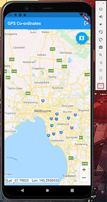
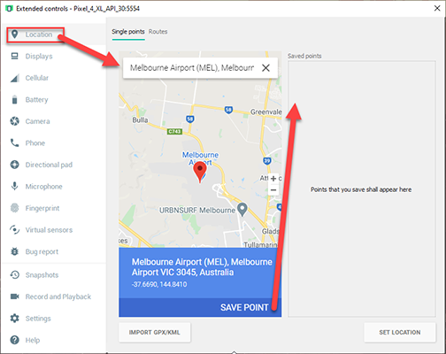

# Module 4

## Introduction
In this module you will learn how to retrieve gps coordinates of a mobile devices location, show this on google maps and push them to an database in AWS. 

## What You Will Learn
* Ask for GPS location permissions of end user
* Recieve GPS location of mobile device on Android / iOS
* Setup Google Maps permissions
* Show GPS location of mobile device on Google Maps
* Save GPS location of mobile device into DynamoDB database in AWS cloud.

## Key Concepts

## Implementation

### Add GPS location dependencies to Flutter
The next step is to add GPS location dependencies as well as configure Android permissions needed for an end user to share a mobile device location.

Add a GPS location library to your pubspec.yaml:
``` dart
... // dependencies: (line 23)

  geolocator: ^6.2.1

... // pubspec.yaml
```

Ensure the following permission is present in your Android Manifest file, located in ```<project root>/android/app/src/main/AndroidManifest.xml```:

``` java
... // <!-- io.flutter.app.FlutterApplication is an android.app.Application that calls FlutterMain.startInitialization(this); in its onCreate method. In most cases you can leave this as-is, but you if you want to provide additional functionality it is fine to subclass or reimplement FlutterApplication and put your custom class here. --> 
... // (line 8)

<uses-permission android:name="android.permission.ACCESS_FINE_LOCATION" />
<uses-permission android:name="android.permission.ACCESS_COARSE_LOCATION" />
<uses-permission android:name="android.permission.ACCESS_BACKGROUND_LOCATION" />

... // AndroidManifest.xml
```

If you are using an Android Emulator please set up a fake location for this lab:



1.  Open the Android Emulator and navigate to the settings screen



2. Within the location tab, type a location into the search and click save point. This will be where the emulator thinks that it is located when the app asks for a GPS location

### Add GPS location coordinate discovery to the app
We will now add the code to request GPS location coordinates to the app.

Open the gps_page.dart file located here: ```<project root>/lib/gps_page.dart``` and add the following into your imports:

``` dart
... // import 'package:flutter/material.dart'; (line 1)

import 'package:geolocator/geolocator.dart';

... // gps_page.dart
```

``` dart
... // import 'package:geolocator/geolocator.dart'; (line 2)

class GpsPage extends StatelessWidget {
  final VoidCallback shouldLogOut;
  GpsPage({Key key, this.shouldLogOut}) : super(key: key);

  @override
  Widget build(BuildContext context) {
    return Scaffold(
      appBar: AppBar(
        title: Text('GPS Co-ordinates'),
        actions: [
          // Log Out Button
          Padding(
            padding: const EdgeInsets.all(8),
            child:
                GestureDetector(child: Icon(Icons.logout), onTap: shouldLogOut),
          )
        ],
      ),
      body: Container(
        child: GpsSubpage(),
      ),
    );
  }
}

class GpsSubpage extends StatefulWidget {
  @override
  _GpsSubpageState createState() => _GpsSubpageState();
}

class _GpsSubpageState extends State<GpsSubpage> {
  // Location
  double currentPositionLat = -37.840935;
  double currentPositionLon = 144.946457;

  // Maps
  GoogleMapController myController;

  void _onMapCreated(GoogleMapController controller) {
    myController = controller;
  }

  void _setNewLocation() async {
    myController.animateCamera(
      CameraUpdate.newLatLng(
        LatLng(currentPositionLat, currentPositionLon),
      ),
    );
  }

  @override
  void initState() {
    super.initState();
  }

  Widget build(BuildContext context) {
    return Stack(
      children: <Widget>[
        GoogleMap(
          onMapCreated: _onMapCreated,
          initialCameraPosition: CameraPosition(
              target: LatLng(currentPositionLat, currentPositionLon),
              zoom: 10.0),
          markers: {
            Marker(
              markerId: MarkerId('Melbourne'),
              position: LatLng(currentPositionLat, currentPositionLon),
            )
          },
        ),
        Padding(
          padding: const EdgeInsets.all(14.0),
          child: Align(
            alignment: Alignment.topRight,
            child: FloatingActionButton(
              // Location
              onPressed: () async {
                var _positionLon;
                var _positionLat;
                await Geolocator.getCurrentPosition().then((value) => {
                      _positionLon = value.longitude,
                      _positionLat = value.latitude,
                    });
                setState(
                  () {
                    currentPositionLon = _positionLon;
                    currentPositionLat = _positionLat;
                  },
                );
                _setNewLocation();
              },
              materialTapTargetSize: MaterialTapTargetSize.padded,
              backgroundColor: Colors.lightBlue,
              child: const Icon(Icons.map, size: 30.0),
            ),
          ),
        ),
        Padding(
          padding: const EdgeInsets.all(14.0),
          child: Align(
            alignment: Alignment.bottomLeft,
            child: Text(
              'Lat: $currentPositionLat    Lon: $currentPositionLon',
              style: TextStyle(
                fontSize: 16,
                background: Paint()..color = Colors.white,
              ),
            ),
          ),
        ),
      ],
    );
  }
}

... //
```

*
*
*
*
*
*

### Add Google Maps dependency to Flutter
Add Google Maps to your pubspec:
``` dart
... // dependencies: (line 23)

  google_maps_flutter: ^2.0.1

... // pubspec.yaml
```

### Add Google maps to the app
Open the gps_page.dart file located here: ```<project root>/lib/gps_page.dart``` and add the following into your imports:

``` dart
... // import 'package:geolocator/geolocator.dart'; (line 2)

import 'package:google_maps_flutter/google_maps_flutter.dart';

... // gps_page.dart
```

**Congratulations, you have finished the workshop!**

[<- Module 3](../module3/README.md) || [Home ->](../README.md) 